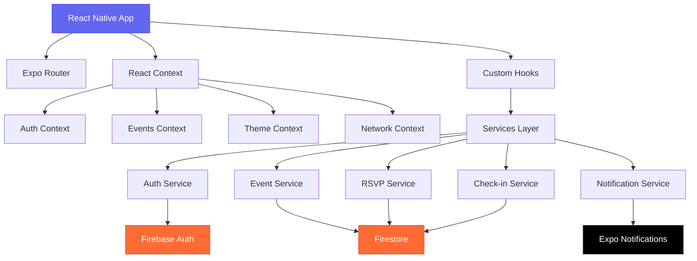
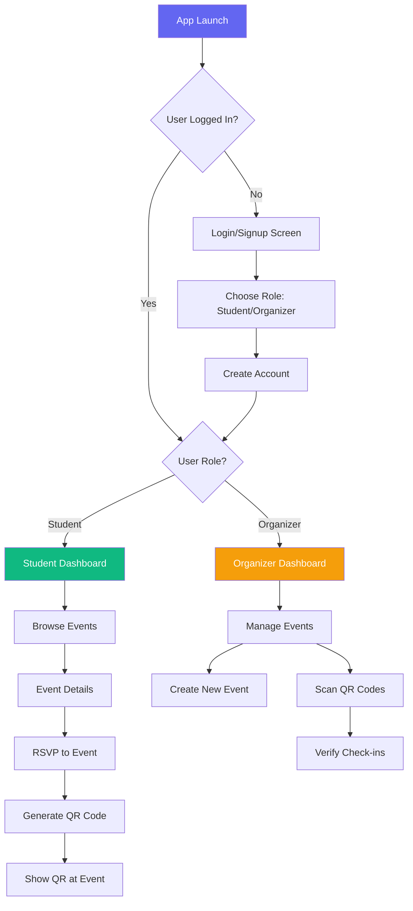

# CampusConnect

<div align="center">
  
  
  
  
</div>

<div align="center">
  <h3>A modern campus event management app built with React Native & Firebase</h3>
  <p>Discover events, RSVP seamlessly, and check-in with QR codes - all in one beautiful app</p>
</div></div>

---

## Features

### For Students
- **Event Discovery** - Browse upcoming campus events with rich details
- **Easy RSVP** - One-tap RSVP with instant confirmation
- **QR Check-in** - Generate QR codes for seamless event check-in
- **My Events** - Track all your RSVP'd events in one place
- **Push Notifications** - Get notified about event updates

### For Event Organizers
- **Event Creation** - Create and manage events with detailed information
- **Event Management** - View RSVPs, attendance, and event statistics
- **QR Scanner** - Scan student QR codes for quick check-in
- **Notifications** - Send push notifications to RSVP'd attendees
- **Analytics** - Track attendance rates and event performance

### Additional Features
- **Dark Mode** - Beautiful light and dark themes
- **Offline Support** - QR codes work without internet connection
- **Role-based Access** - Different features for students and organizers
- **Real-time Updates** - Live event updates across all devices

---

## Architecture



## Tech Stack

| Category | Technology | Purpose |
|----------|------------|---------|
| **Framework** | React Native 0.81.5 | Cross-platform mobile development |
| **Platform** | Expo SDK 54 | Development tools and services |
| **Navigation** | Expo Router 6.0.15 | File-based routing system |
| **Backend** | Firebase 12.6.0 | Authentication & Database |
| **Database** | Firestore | Real-time NoSQL database |
| **Language** | TypeScript 5.9.2 | Type-safe JavaScript |
| **State Management** | React Context | Global state management |
| **Notifications** | Expo Notifications | Push notifications |
| **QR Codes** | react-native-qrcode-svg | QR code generation |
| **Camera** | Expo Camera | QR code scanning |

---

## Download & Installation

### For Users (APK Download)

1. **Download the APK**
   ```bash
   # Download from releases page
   wget https://github.com/Aerospace-prog/Campus-Connect/releases/download/latest/Campus.Connect.V1.apk
   ```

2. **Install on Android**
   - Enable "Install from Unknown Sources" in Android settings
   - Open the downloaded APK file
   - Follow installation prompts
   - Launch CampusConnect from your app drawer

3. **Create Account**
   - Open the app and tap "Sign Up"
   - Choose your role: **Student** or **Event Organizer**
   - Fill in your details and start exploring events!

### For Developers

#### Prerequisites
- Node.js 18+ 
- npm or yarn
- Expo CLI
- Android Studio (for Android development)
- Xcode (for iOS development, macOS only)

#### Setup Instructions

1. **Clone the repository**
   ```bash
   git clone https://github.com/aerospace-prog/Campus-Connect.git
   cd CampusConnect
   ```

2. **Install dependencies**
   ```bash
   npm install
   ```

3. **Configure Firebase**
   ```bash
   # Copy environment template
   cp .env.example .env
   
   # Add your Firebase configuration to .env
   EXPO_PUBLIC_FIREBASE_API_KEY=your_api_key
   EXPO_PUBLIC_FIREBASE_AUTH_DOMAIN=your_auth_domain
   EXPO_PUBLIC_FIREBASE_PROJECT_ID=your_project_id
   # ... other Firebase config
   ```

4. **Start development server**
   ```bash
   npx expo start
   ```

5. **Run on device/emulator**
   - Press `a` for Android emulator
   - Press `i` for iOS simulator
   - Scan QR code with Expo Go app for physical device

---

## User Flow



## Key Screens

The app includes several key screens designed for both students and event organizers:

- **Events Discovery** - Browse and search upcoming campus events
- **Event Details** - View comprehensive event information and RSVP
- **QR Check-in** - Generate personal QR codes for event attendance
- **QR Scanner** - Admin tool for scanning and verifying attendee QR codes
- **User Profile** - Manage account settings and view activity statistics
- **Dark Mode** - Full support for light and dark themes

---

## Development

### Project Structure
```
CampusConnect/
├── app/                      # Screens (file-based routing)
│   ├── (auth)/              # Authentication screens
│   ├── (tabs)/              # Main app tabs
│   ├── event/[id].tsx       # Dynamic event details
│   └── qr-code/[eventId].tsx
├── components/              # Reusable UI components
├── config/                  # Firebase configuration
├── constants/               # Theme & styling
├── contexts/                # React Context providers
├── hooks/                   # Custom React hooks
├── services/                # Business logic layer
├── types/                   # TypeScript definitions
└── utils/                   # Utility functions
```

### Key Features Implementation

#### Authentication Flow
```typescript
// Auto-redirect based on auth state
useEffect(() => {
  const unsubscribe = AuthService.onAuthStateChanged((user) => {
    if (user) {
      router.replace('/(tabs)');
    } else {
      router.replace('/(auth)/login');
    }
  });
  return unsubscribe;
}, []);
```

#### Real-time Event Updates
```typescript
// Live event synchronization
useEffect(() => {
  const unsubscribe = EventService.subscribeToEvents((events) => {
    setEvents(events); // UI updates automatically
  });
  return unsubscribe;
}, []);
```

#### QR Code Generation
```typescript
// Offline-capable QR codes
const qrData = JSON.stringify({
  userId: user.uid,
  eventId: event.id,
  timestamp: Date.now(),
  version: '1.0'
});
```

---

## Testing

```bash
# Run tests
npm test

# Run tests with coverage
npm run test:coverage

# Run linting
npm run lint

# Type checking
npm run type-check
```

---

## Deployment

### Building for Production

1. **Configure EAS Build**
   ```bash
   npm install -g @expo/eas-cli
   eas login
   eas build:configure
   ```

2. **Build APK**
   ```bash
   # Build for Android
   eas build --platform android --profile production
   
   # Build for iOS
   eas build --platform ios --profile production
   ```

3. **Submit to Stores**
   ```bash
   # Submit to Google Play Store
   eas submit --platform android
   
   # Submit to App Store
   eas submit --platform ios
   ```

---

## Contributing

We welcome contributions! Please follow these steps:

1. **Fork the repository**
2. **Create a feature branch**
   ```bash
   git checkout -b feature/amazing-feature
   ```
3. **Make your changes**
4. **Add tests for new features**
5. **Commit your changes**
   ```bash
   git commit -m 'Add amazing feature'
   ```
6. **Push to your branch**
   ```bash
   git push origin feature/amazing-feature
   ```
7. **Open a Pull Request**

### Development Guidelines
- Follow TypeScript best practices
- Write tests for new features
- Use conventional commit messages
- Update documentation for API changes


---

## Support

- **Issues**: [GitHub Issues](https://github.com/aerospace-prog/Campus-Connect/issues)
- **Discussions**: [GitHub Discussions](https://github.com/aerospace-prog/CampuspConnect/discussions)

---

<div align="center">
  <p>Made with ❤️ for the campus connect developer</p>
  <p>
    <a href="#campusconnect">Back to Top</a>
  </p>
</div>
